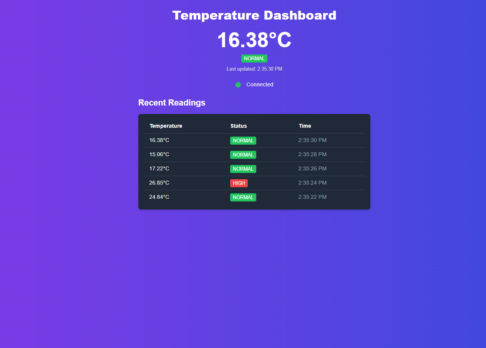

# Temperature Dashboard

## Overview

The **Temperature Dashboard** is a real-time monitoring application built with **React**, **Next.js**, **Socket.IO**, and **TailwindCSS**. It displays live temperature readings from a backend, shows the current status (normal or high), and provides a history of the last 5 temperature readings. The application uses WebSockets to update the dashboard in real time as new data is emitted.

## Table of Contents

1. [System Requirements](#system-requirements)
2. [Installation](#installation)
3. [Usage](#usage)
4. [Folder Structure](#folder-structure)
5. [Docker Setup](#docker-setup)
6. [Dependencies](#dependencies)
7. [License](#license)

## System Requirements

- **Node.js** (v18+)
- **MongoDB** (For storing temperature readings)
- **React** (Frontend Framework)
- **Next.js** (For server-side rendering)
- **Socket.IO** (For real-time communication)
- **TailwindCSS** (For styling)
- **n8n** (Optional for processing)

## Installation

### 1. Clone the repository:

```bash
git clone <repository-url>
cd <project-directory>
```

### 2. Install dependencies:

For **frontend** (React/Next.js):

```bash
cd frontend
npm install
```

For **backend** (Node.js, MongoDB, Socket.IO):

```bash
cd backend
npm install
```

For **n8n** (optional for processing):

```bash
cd n8n
npm install
```

### 3. Set up environment variables:

Create a `.env.local` file in the root of your **frontend** project and add:

```bash
NEXT_PUBLIC_API_URL=http://localhost:5000  # Backend API URL
```

For the **backend**, create a `.env` file and configure the MongoDB connection:

```bash
MONGODB_URL=mongodb://localhost:27017/temperature_db
PORT=5000
```

## Usage

1. **Start the Backend:**

Navigate to the backend folder and run:

```bash
npm run dev
```

This will start the backend server at `http://localhost:5000`.

2. **Start the Frontend:**

Navigate to the frontend folder and run:

```bash
npm run dev
```

This will start the Next.js frontend at `http://localhost:3000`.

3. **Start n8n (Optional):**

If you're using n8n for processing, start it by running the following in the n8n directory:

```bash
npm run dev
```

4. Open the frontend URL in a browser. The dashboard will display real-time temperature readings.

## Docker Setup

You can use **Docker** and **Docker Compose** to quickly set up the environment for this project. The `docker-compose.yml` file at the root of the project contains configurations for the frontend, backend, MongoDB, and n8n services.

### 1. Run Docker Compose:

In the root of the project, run:

```bash
docker-compose up --build
```

This will build and start all necessary services (frontend, backend, MongoDB, and optionally n8n) in containers.

### 2. Access the Application:

- **Frontend** will be accessible at `http://localhost:3000`
- **Backend** will be accessible at `http://localhost:5000`
- **n8n** (if enabled) will be accessible at `http://localhost:5678`

### Docker Compose Configuration:

The `docker-compose.yml` file includes the following services:

```yaml
version: '3'
services:
  frontend:
    build: ./frontend
    ports:
      - '3000:3000'
    depends_on:
      - backend
    networks:
      - app-network

  backend:
    build: ./backend
    ports:
      - '5000:5000'
    depends_on:
      - mongodb
    networks:
      - app-network

  mongodb:
    image: mongo
    ports:
      - '27017:27017'
    networks:
      - app-network

  n8n: # Optional processing service
    image: n8nio/n8n
    ports:
      - '5678:5678'
    networks:
      - app-network
    environment:
      - N8N_BASIC_AUTH_ACTIVE=true
      - N8N_BASIC_AUTH_USER=user
      - N8N_BASIC_AUTH_PASSWORD=password

networks:
  app-network:
    driver: bridge
```

## Folder Structure

### Frontend

```
frontend/
│
├── pages/
│   ├── index.tsx       # Main Dashboard page
├── styles/             # TailwindCSS styles
│   ├── globals.css
│
├── public/             # Static assets
│   ├── images/
│
└── next.config.js      # Next.js configuration
```

### Backend

```
backend/
├── src/
│   ├── controllers/     # Logic for handling routes
│   │   └── temperature.controller.ts
│   ├── database/        # MongoDB connection logic
│   │   └── connect.ts
│   ├── models/          # MongoDB schemas/models
│   │   └── temperature.model.ts
│   ├── routes/          # API routes
│   │   └── temperature.routes.ts
│   ├── services/        # Business logic (temperature processing)
│   │   └── temperature.service.ts
│   ├── server.ts        # Server setup and WebSocket handling
│   └── index.ts         # Main entry point for backend
├── Dockerfile
├── package.json
└── tsconfig.json
```

### n8n (Optional)

```
n8n/
├── workflows/
├── └── temperature-alert-workflow.json               # n8n environment variables
├── Dockerfile
├── docker-compose.yml  # For local setup of n8n
└── package.json
```

## Dashboard Screenshot

Below is a screenshot of the Temperature Dashboard:



## Dependencies

### Frontend

- **React**: JavaScript library for building user interfaces.
- **Next.js**: React framework for server-side rendering and static website generation.
- **Socket.IO-client**: For WebSocket communication from frontend.
- **TailwindCSS**: For utility-first CSS styling.
- **Framer Motion**: For UI animations.

### Backend

- **Node.js**: JavaScript runtime.
- **Express.js**: Web framework for building RESTful APIs.
- **Socket.IO**: For WebSocket communication to emit real-time updates.
- **MongoDB**: NoSQL database to store temperature readings.
- **Axios**: Promise-based HTTP client for making requests.
- **n8n** (Optional): Automation tool for processing and status updates.
